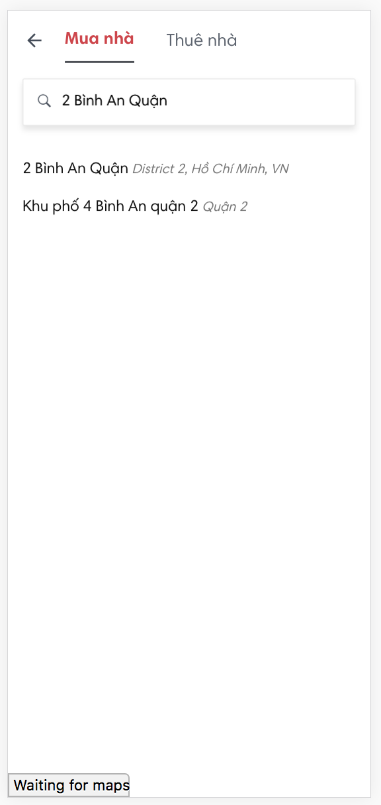
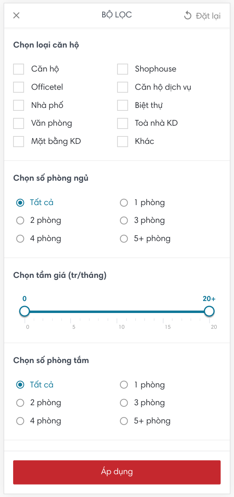

# Product Drill Down

## Prerequisite fields

Những fields bắt buộc phải chọn trước khi bắt đầu drill down. Mục đích là để tùy chọn các filter thích hợp sau. Ví dụ như là `price range`

- `type` (`sold` / `rent`): Phải biết được là mua / hoặc cho thuê

## Refenrence

### Rever Notes

- Prerequsite fields của `Rever.vn` là: `type`, `location`. Tức là phải chọn type / location cụ thể rồi mới bắt đầu drill down được.

- Rever có support drill-down theo `map`

Notes:
- Nếu thêm Location / Map vào prerequisite filter thì sẽ không filter được 2 quận cùng 1 lúc. Ví dụ như 1 người muốn thuê nhà ở quận 5, quận 11 hoặc quần phú nhuận thì không thể drill down theo cách này. Homedy cũng chỉ có thể
- Cách khắc phục cho Approach này là thêm tính năng `save lại các query` cho người dùng

### Homedy Notes

## Search Field

- Loại (`Product Category`): Như là căn hộ, officetel, condotel ...
- Location / Map: Chỉ có thể chọn 1 trong 2 -> Cách làm của `Rever` là redirect từ Location qua `Map` + thêm field `Title` để optimize SEO
- Số phòng ngủ
- Số phòng tắm
- Tầm giá
- Hướng
- Map

## Specs

### Chọn Prequisite Search

### Chọn Drill Down

## Url

Để SEO

### Các thông tin cần được đưa lên url

Chỉ chọn 1 số thông tin nhất định, đừng làm url quá dài, Các giá trị còn lại có để đưa vào title, meta keywords, meta description

- **type**: `mua`, có thể là `/mua`, `/cho-thue`
- **category**: `can-ho-mini`, là 1 product category, có thể là `condotel`, `biet-thu`, ...
- **price-range**: `gia-duoi-1-ty`, có thể là `gia-tu-1-ty-den-2-ty`, `gia-tu-200-trieu-den-2-ty`, `gia-tren-500-trieu`
- **location**: `tai-quan-8-tp-hcm`, có thể là `tai-tp-hcm`, `tai-phuong-11-quan-8-tp-hcm` (Dev Note: Phải có thể 1 `collection` để lưu trữ location, tức là từ 1 string -> `{ province: 'xxx' }`, hoặc `{ province: xxx, district: yyy, ward: zzz }`)
- ...

### Example

`mua--nha--gia-duoi-1-ty`
`cho-thue--nha--tai-phuong-11-quan-8-tp-hcm`
`/mua--can-ho-mini--gia-duoi-1-ty--tai-quan-8-tp-hcm--co-2-phong-ngu`

### Todo

- Đưa ra các trường `filter` + `url thực tế cho các trường hợp` -> dùng để làm test case
- Parsing qua lại giữa Elasticsearch query và string
- Có thể dùng `--` để split ra các field
